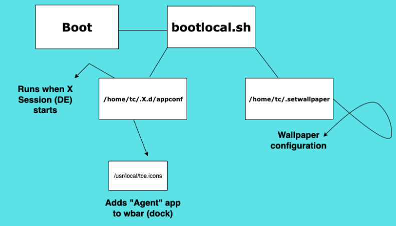

# AgenticCore

World's first agentic operating system.

## Base System

AgenticCore is based on [Tiny Core Linux](http://tinycorelinux.net/), which is licensed under the [GPLv2 License](https://www.gnu.org/licenses/old-licenses/gpl-2.0.html).

Tiny Core's original source code is available at: http://tinycorelinux.net/

## My Contributions

This repository contains my custom scripts, configuration files, and packages used to make AgenticCore.

# Contents

- [About](#about)
- [Features](#features)
- [Installation](#installation)
- [Usage](#usage)
- [Repository Contents](#repository-contents)
- [How it works](#how-it-works)
- [Development Process](#development-process)
- [Build](#build)
- [License](#license)
- [Contact](#contact)
- [Support](#support)

# About
AgenticCore is world's first agentic operating system which can do tasks for you. It has 2 versions: Local and Gemini API. Local uses a custom build of Llama.cpp for Tiny Core while Gemini API version uses Google's Gemini 2.0 Flash API. 

Its capable of generating bash scripts and you can run it with just a click of a button.
Still being in Alpha release, AgenticCore doesnt work flawless for now. We can make it "perfect" together!

# Features
## Local Version
- Being able to choose your own .GGUF AI model
- Being able to change the model by your use-cases anytime.
- No internet connection required.
- Agentic.

## Gemini API Version
- Slightly ligther than Local Version.
- Works faster on old machines.
- Smarter compared to small local models.
- Agentic.

# Installation
**NOTE:** Unfortunately, AgenticCore *currently* doesnt support UEFI.

## Real Device
1. Download the latest release of your desired version from [AgenticCore Website](https://agentic-core.web.app)
2. Flash it to a USB Drive using tools like [Rufus](https://rufus.ie/), [Balena Etcher](https://etcher.balena.io/) etc.
3. Boot it from BIOS menu.
4. For Local version, you can load your .GGUF model from another USB flash and use AgenticCore!
5. For Gemini API version, you can connect to wifi using WiFi program in the dock at top-right and use AgenticCore!

## Virtual Machine
1. Download the latest release of your desired version from [AgenticCore Website](https://agentic-core.web.app)
2. Create a virtual machine in your desired VM application. (OS type: Other Linux (64 bit))
3. Boot your VM.
4. For Local version, you can load your .GGUF model using shared folders function of your VM application.
5. For Gemini API version:
-  If you have NAT option enabled, it should already be connected to internet. You can use AgenticCore directly!
- If you are using bridged adapters, you can connect to wifi using WiFi program in the dock at top-right and use AgenticCore!

# Usage
Using AgenticCore is simple!
Some of the things you need to know:
- Use the dock at top-right to launch applications.
- Use the app called "Agent" in dock to use agent.
- Just ask AI what to do.
- When AI generates a script, you can always reveal the code and inspect the code or run it right away by just pressing the "Run" button.

# Repository Contents
[scripts/main.py](./scripts/main.py "scripts/main.py") -> "Agent" Program of **Local Version!**

[scripts/bootlocal.sh](./scripts/bootlocal.sh "scripts/bootlocal.sh") -> Creates required files for wbar configuration.

[tc-llamacpp/llama-server](tc-llamacpp/llama-server "tc-llamacpp/llama-server") -> The custom build of portable llama-server for Tiny Core, being used by "Agent" app of local version.

Other files / Explanations will be released soon!

# How it works
## GUI

`bootlocal.sh` creates required files which creates other required files when X session (desktop environment) starts up.

## "Agent" App

When launched,
- Gemini API version directly starts (chat screen).
- Local version starts a model selection screen and when model is selected, chat screen starts.

# Development Process
- In early 2025, i had this idea, AI-implemented operating systems. I thought there are already some prototypes of this, because it was a cool idea for me. After a quick research, i realised that there is no agentic operating system ever released. I wanted to instantly start this project, but as a 13 year-old student, this year i had a big final exam and working to that. So i didnt be able to.

- In early this summer (01.07.2025), since my exam was over, i checked again, thought some people or companies made a demo of this already. But no, there were still no agentic operating systems in the world!

- In 02.07.2025, i started to work on it. I firstly developed a simple UI for Agent app using Python and Tkinter, since tkinter is light and enough for this project. Made a simple chatbot that uses Gemini API but doesnt have the "agentic" functions yet.

- In 03.07.2025, i implemented basic "agentic" functions using some system prompts and special formats. We were able to see and run the code it generates!

- In 04.07.2025, i did some bugfixes to "Agent" script and booted Tiny Core on a computer to begin the development of AgenticCore itself. I started by downloading the wifi.tcz with its dependencies on my Arch Linux partition using [FetchExt.sh tool](https://forum.tinycorelinux.net/index.php/topic,23034.0.html "FetchExt.sh tool"). Then i succesfully connected to internet and installed python3.9, python3.9-setuptools and pip to my system like this:
`python3 -m ensurepip --default-pip` - This currently installs an older version of pip. So:
`python3 -m pip install --upgrade pip` to update it.

- In 05.07.2025, i have installed google-genai and couple of other dependencies of current "Agent" Python program. To make it portable, i have used `--target` flag of pip. I planned the "universal" file paths for AgenticCore. Packages were going to be in `/ace/` which stands for AgenticCore Extensions. Im also planning to develop and release ACE extension manager as an alternative of TCE as well in next versions! Anyways, i ran the program and debugged it a little bit. It was working. I have created the first version which only had the program inside (for Gemini API version) using `ezremaster` tool and first version of AgenticCore was actually done! (16-1-1)

- In 06.07.2025, i have designed the logo and did some experiments about `wbar` and wallpaper configuration. We can say these were the "last touches". Current version uses [bootlocal.sh](scripts/bootlocal.sh "bootlocal.sh") to create custom wallpaper and wbar config at startup. But 16-1-2 used manually created appconf file in `/home/tc/.X.d` which executes scripts inside of it. So this day, i have built 16-1-2 first and a little improved version of it, 16-1-3. It have gained its current look!

- In 07.07.2025, i found another bug about Agent program and wbar configuration. So i fixed them as well and created the 16-1-4 version, first public release of AgenticCore! In the same day, i created the basic design of AgenticCore website and released Gemini API version 16-1-4!

- In 08.07.2025, i thought making a local version of AgenticCore would be cool, but only planned it in my mind. Other than that, i gave a break :)

- In 09.07.2025, i tried to install llama-cpp-python, installed all the dependencies but i think there were some conflicts with the system, because i debugged for hours but didnt be able to install it. So, i tried building llama.cpp itself. Of course, intended way to build it didnt work. I tried adding `-DLLAMA_STATIC=ON` flag but turns out its deprecated. I tried my chance by `-DCMAKE_EXE_LINKER_FLAGS="-static"` but it gave segmentation fault's so it was broken. I git checkout'd to older versions and tried `-DLLAMA_STATIC=ON` again but when i check the build with `ldd llama-cli` it was showing that its actually still dynamic! After few more hours of trying, i realised its portable even when its dynamic. So my last flags were `-DLLAMA_CURL=OFF` (because we dont need to gather models from hugging face directly in AgenticCore), `-DBUILD_SHARED_LIBS=OFF` (just in case) and `-DCMAKE_BUILD_TYPE=Release`. At the end of the day, i finally have built Llama.cpp specifically for TinyCorePure64!

- In 09.07.2025, i have tried to find a way to integrate the `llama-cli` with python, because as i said, we couldnt use llama-cpp-python. This is lighter and working! So i tried to use some methods i found in [here](https://github.com/ggml-org/llama.cpp/discussions/777 "here") but none of them worked. So i "mixed" some of them and `./llama-cli -m model.gguf -p "Hi" --no-display-prompt 2> /dev/null` was working. But there was an issue: it was waiting for the user input after AI response. So program wasnt finishing. I tried to develop some bash programs which kills the process after no output for 2 seconds etc. to get the raw output, but It wasnt a reliable way to do this. So i planned to use `llama-server` and used `requests` package to get responses from locally-hosted AI.

- In 10.07.2025, i made what i have planned, edited the "Agent" script lots of times, debugged for hours and it was finally working with AI models locally using `llama-server` to host it on localhost.

- In 11.07.2025, i tried the `llama-server` method's portability using simple remasters. It was working!

- In 12.07.2025, i rested :)

- In 13.07.2025, i have created the first "finished" local version as well! But it took a couple of tries, so i built it several times this day. Finally, it was finished!

- In 14,07.2025, i released the AgenticCore's first local version as well! Then, did some updates to AgenticCore Website, including forums. Note: I got help from AI to make some parts of the website and forum section, because im not mainly a web developer. Other than that, AI is not used in the development of AgenticCore!

- In 15.07.2025, i posted about AgenticCore on reddit. It got deleted from 2 subreddits in just a hour due "too much reports". I dont know why :/

# Build
You can follow these steps to build AgenticCore by yourself.

## Local Version
1.  Download *TinyCorePure64* as base.
	- You can download the latest version of Tiny Core. Currently, latest release of Tiny Core is 16.1. [Click here to download. ](http://tinycorelinux.net/16.x/x86_64/release/ "Click here to download. ") Just click to *TinyCorePure64-current.iso* or your preferred version.
2. Boot it up.
	- Using a real machine is recommended but VM should work as well.
3. Copy the contents in this repo to a USB drive.
	- You can use "shared folders" on VM.
4. Mount the USB drive to Tiny Core.
	- You can use Mount Tool in the dock (wbar).
5. Connect to internet.
	- If you prefer Ethernet, directly mount and continue.
	- If you prefer WiFi:
		- Copy the **contents** of *tc-wificonfig* folder in your USB drive to */tmp/tce/optional* like this:
		`sudo cp -r /mnt/yourusbdrive/tc-wificonfig/. /tmp/tce/optional`
		- Since we put the files of WiFi package in the system, we can install it without an internet connection using:
		`tce-load -i wifi`
		- Now, WiFi app should appear at the dock (wbar) below. You can open it there or use:
		`sudo wifi.sh`
		Directly in terminal. It should scan the WiFi networks and number them. Choose yours, enter the password and done.
		- You can test it using `ping google.com`
6. Install required packages.
	`tce-load -wi python3.9 python3.9-setuptools tk8.6 ezremaster`
	Install and update pip:
	`python3 -m ensurepip --default-pip`
	`python3 -m pip install --upgrade pip`
7. Building
	1. Test in current system.
		- Create the required folders:
		`sudo mkdir -p /ace/LocalAgent/gui`
		- Install required packages to specific path.
		`python3 -m pip install --target=/ace/LocalAgent/gui requests`
		- You should see some files and folders in */ace/LocalAgent/gui/* now.
		- Copy local-main.py as main.py to */ace/LocalAgent/gui/*.
		`sudo cp /mnt/yourusbdrive/scripts/local-main.py /ace/LocalAgent/gui/main.py`
		- Copy custom-built Llama.cpp for AgenticCore to */ace/LocalAgent/*
		`sudo cp -r /mnt/yourusbdrive/tc-llamacpp /ace/LocalAgent`
		- Test if it works (you need a .GGUF AI model)
		`sudo python3 /ace/LocalAgent/gui/main.py`
		- A window to select your model file should appear. Select your model file simply using file manager. You can copy it in your USB drive and select it from */mnt/yourusbdrive/yourmodel.gguf*
	2. Build!
		- Copy your *TinyCorePure64-current.iso* (or whatever version you choose) file from your USB drive to */home/tc*:
		`sudo cp /mnt/yourusbdrive/TinyCorePure64-current.iso /home/tc`
		- Open ezremaster using the dock (wbar) or by running `sudo ezremaster`
		- Select ISO option and select your TinyCorePure64 iso as path.
		- Next.
		- Add required packages (+ any other package you want) to "Outside initrd apps on boot" section.
			- Required packages:
				- python3.9
				- tk8.6
			- Recommended packages (extra):
				- nano
				- wifi
		- Next > No SCM package needed so Next again.
		- ezremaster should give us 2 paths: */tmp/ezremaster/image* and */tmp/ezremaster/extract*.  Changes in *image* are optional but we should do some changes in *extract*:
			- Copy */ace* to */tmp/ezremaster/extract*.
			`sudo cp -r /ace /tmp/ezremaster/extract`
			- Change bootlocal.sh in */tmp/ezremaster/extract/opt*
			`cd /tmp/ezremaster/extract/`
			`rm -rf opt/bootlocal.sh`
			`sudo cp /mnt/yourusbdrive/scripts/bootlocal.sh opt/`
			- Copy *acore.png* and *logo.png* in media to */tmp/ezremaster/extract/usr/local/share/pixmaps/*
			(Make sure you're in /tmp/ezremaster/extract)
			`sudo mkdir -p usr/local/share/pixmaps/`
			`sudo cp /mnt/yourusbdrive/media/logo.png usr/local/share/pixmaps/`
			`sudo cp /mnt/yourusbdrive/media/acore.png usr/local/share/pixmaps/`
			- Copy .setbackground to ace.
			(Make sure you're in /tmp/ezremaster/extract)
			`sudo cp /mnt/yourusbdrive/scripts/.setbackground ace`
			- Since we copied */ace*, *bootlocal.sh*, *logo.png*, *acore.png*, *.setbackground* and installed required extensions (packages), we can now click to **Build ISO** button.
			- Building process can take up to 20 minitues depending on your device or your changes (additional packages etc.)

	3. Done!
	- You can now build the local version of AgenticCore completely by yourself.

## Gemini API
Releasing soon.

# License
AgenticCore is licensed under the Apache License 2.0.
See the [LICENSE](./LICENSE) file for details.

# Contact
You can use the [contact section of AgenticCore website](https://agentic-core.web.app/index.html#contact "contact section of AgenticCore website") or just mail at [tachion.software@gmail.com](mailto:tachion.software@gmail.com?subject=AgenticCore "tachion.software@gmail.com") to contact with me. Thanks!

# Support
You can support me, development of AgenticCore and my other projects [here.](https://buymeacoffee.com/myusuf "here.") Any donation is appreciated!
